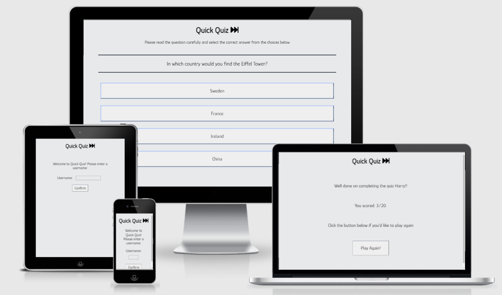
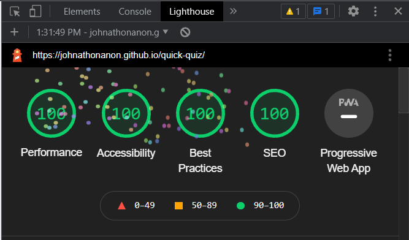

# Quick Quiz

Quick Quiz is a javascript centric site in which the user can partake in a 20 question long multiple choice quiz in order to have some fun and test their general knowledge. The questions are randomly generated and answers randomly assigned to one of four possible buttons to enhance the user experience. The questions are a mix of relative difficulty levels and subjects so as to appeal to a broad range of people, and hopefully entice them to broaden their knowledge while also catering to the interests they may already have. The site is simple and modern, and allows the user to quickly and seemlessly work their way through the questions without becoming bored or bogged down. There is no time limit on the user answering a particular question. This allows them to search the answer before continuing on if they wish. Conversely they can finish the entire quiz before receiving their ultimate score, at which point they are prompted to try again if so desired. This functionality enables the user to then potentially carry out some research into questions they may be unsure of, or challenge themselves by building on their previous attempt by choosing a different answer to question they may be unsure of.

The live link can be found here - https://johnathonanon.github.io/quick-quiz/

 

## Features

### Existing Features

- **Heading**

  - Heading remains static as the site progresses. It is the title of the site and as such is front and centre at all times. It is stylish but minimalist so as to not overwhelm the user but rather provide a constant point throughout the progression of the quiz.
 
  

- **Social Media Icons**

  - Responsive social media icons for the purpose of the user to connect with the Author/Historian in order to get in touch, or learn more about Padraig Deignan. These contain links to the home pages of the included sites for those social media sites Padraig is not currently a member of. All sites open in a new tab. At < 600px these center under the navbar for a neater user experience. The icons change colour when hovered on.

- **The Index Page**

  - This introduces the user to what the website is about. This is a simple visual representation that the website is about Padraig Deignan and who he is (Author and Historian). A books section has a visual representation of his work, and clicking on the images redirects to the books.html section of the relevant title.

  

- **About**

  - The about section will allow the user to read a short section about the background of Padraig Deignan, and how he became who is today. This section will allow the user to get a more in-depth perception of who Padraig Deignan is as an Author/Historian. It will allow the user to develop a connection with the subject of the site.

  

- **Books**

  - This section will allow the user to purchase books via included links and also view the books Padraig Deignan has written. They will have brief sections on each book describing the contents.

  

  

- **Media**

  - In this section the user can view videos featuring Padraig Deignan.

  

- **Contact**

  - This section contains a form which will allow the user to contact Padraig by email. All fields are required, meaning the from has to filled correctly in order to be submitted. Once all fields are entered and submit button is pressed the user is redirected to the thanks page.

  
  
  
  
  

- **Footer**

  - The footer is has a copyright of the owner and the year it was published. The right hand side of the footer will contain icons that are responsive/interactive that will bring the user to Padraig Degnan's Social media outlets. These icons are removed at lower screen sizes to make the site neater for the user.

  
  

### Features Left to Implement

- As of now the contact form only brings the user to the thanks.html file. In the future this form should allow the user to send Padraig a message via email.

- My mentor mentioned the about section appeared "wordy", especially on mobile devices, and I agree with this assertion. Despite this, the purpose of the about section is to impart information about the site subject and so I feel it still performs its intended function and remains succinct enough as to not cause users to have a poor experience. However, it is my intention to potentially implement a "read more" button in the future so as to add to the user experience aspect of the site.

## Testing

The site has been consistently tested throughout its development. Any time a new feature was introduced or style change made, this was tested using chrome developer tools.

All html elements serve their intended purpose at time of submission. All styles work as intended and add to the overall user experience. The site has been stringently tested on a large number of different browsers and screen sizes both using emulators on dev tools as well as physical mobile devices and tablets. Both the site subject and others viewed the site on a number of personal platforms, android and ios, and found the site to work as intended on different screen sizes and browsers.

The footer on the Contact page had white space underneath it at < 1350px. The only way with my current knowledge and given time constraints to resolve this issue was to increase the image size on the contact page in order to eliminate the white space. This solution is not ideal and I intend to resolve it but the site still functions and appears as intended.

The hamburger menu at < 600px displayed in the incorrect direction most of its implementation, however comments from the site subject as well as others who viewed the site on a mobile device led me to fix this pre-submission.

All links, both internal and external, have been checked and confirmed working on a multitude of browsers including Google Chrome, Mozilla Firefox, Microsoft Edge, and Safari. 

Any forms and videos act as intended. 

The site works as intented on all tested platforms.

One of the largest challenges faced when implementing media queries for smaller device sizes was that certain elements had been given size values in pixels at the start of development. This caused an unnecessary amount of time to be spent fixing broken style through the development process, however it also resulted in a better site and a greater understanding of the priciples behind html and css.

Efforts were made beginning, during, and at the end of development to optimise the site as best as possible. This included colour palette generators and contrast checkers for accessibility, the addition of alt attributes where necessary, reduction of image file sizes to help load times, and search engine optimisation.

A colour palette was generated and the chosen colours ran through a contrast checker to ensure a pleasant experience and large degree of accessibility for the site. 

The site subject - Padraig Deignan - was kept informed of all design and content choices as they were made as well as contributing much of both. He was sent screenshots and videos of the site in order to provide feedback on site functions and navigation elements. During the development process he requested several amendments which were immediately implemented and reapproved by him.

### Validator Testing

- HTML
  - No errors were returned when passing through the official [W3C validator](https://validator.w3.org/nu/?doc=https%3A%2F%2Fcode-institute-org.github.io%2Flove-running-2.0%2Findex.html)
- CSS
  - No errors were found when passing through the official [(Jigsaw) validator](https://jigsaw.w3.org/css-validator/validator?uri=https%3A%2F%2Fvalidator.w3.org%2Fnu%2F%3Fdoc%3Dhttps%3A%2F%2Fcode-institute-org.github.io%2Flove-running-2.0%2Findex.html&profile=css3svg&usermedium=all&warning=1&vextwarning=&lang=en#css)

### Unfixed Bugs

- As mentioned above the contact page displayed white space underneath the footer at < 1350px and I "fixed" this by increasing the height of the background image. I am aware that this is not ideal but given time constraints I was concerned that my attempts to rectify this may cause the page to break at other screen sizes and compound the issue, resulting in me getting bogged down in troublshooting and wasting time. The site still functions as intended and this page still adheres to the intented style and user experience.

## Deployment

- The site was deployed to GitHub pages. The steps to deploy are as follows:
  - In the GitHub repository, navigate to the Settings tab
  - From the source section drop-down menu, select the Main Branch
  - Once the Main Branch has been selected, the page will be automatically refreshed with a detailed ribbon display to indicate the successful deployment.

The live link can be found here - https://johnathonanon.github.io/padraig-deignan/about.html

## Credits

http://padraigdeignan.simplesite.com/415329717 

https://www.youtube.com/watch?v=xMTs8tAapnQ (I used this for the burger menu)

https://liber.ie/product/protestant-community-in-sligo-1914-49/

https://liber.ie/product/land-and-people-in-nineteenth-century-sligo/

https://liber.ie/product/sligo-in-the-eighteenth-century/

https://www.youtube.com/watch?v=4jrTHiWFcAE

https://www.youtube.com/watch?v=O_Xj8Jrenwk

https://code-institute-org.github.io/love-running-2.0/signup.html (Used this code to help with my contact page)

### Content

- All written content and photos were approved by Padraig Deignan himself. Padraig Deignan supplied the photos used on the website of himself from his personal computer harddrive.
- The icons in the header were taken from [Font Awesome](https://fontawesome.com/)
- The photos used for the books were taken from Pagraig Deignans Facebook [with permission and approval] (https://www.facebook.com/padraig.deignan)

### Media

- The photo used on contact page are from this open source (https://unsplash.com/)
- The color pallette was generated using this source (Adobe Color - https://color.adobe.com/)
- Contrast Checker was used to help with user experience (WebAim Contrast Checker - https://webaim.org/resources/contrastchecker/)
- Fonts were derived from (Google Fonts - https://fonts.google.com/)
- Videos on media section were embedded using a youtube embed link

