# Quick Quiz

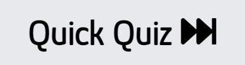

Quick Quiz is a javascript centric site in which the user can partake in a 20 question long multiple choice quiz in order to have some fun and test their general knowledge. The questions are randomly generated and answers randomly assigned to one of four possible buttons to enhance the user experience. The questions are a mix of relative difficulty levels and subjects so as to appeal to a broad range of people, and hopefully entice them to broaden their knowledge while also catering to the interests they may already have. The site is simple and modern, and allows the user to quickly and seemlessly work their way through the questions without becoming bored or bogged down. There is no time limit on the user answering a particular question. This allows them to search the answer before continuing on if they wish. Conversely they can finish the entire quiz before receiving their ultimate score, at which point they are prompted to try again if so desired. This functionality enables the user to then potentially carry out some research into questions they may be unsure of, or challenge themselves by building on their previous attempt by choosing a different answer to question they may be unsure of.

The live link can be found here - https://johnathonanon.github.io/quick-quiz/

 

## Features

### Existing Features

- **Heading**

  - Heading remains static as the site progresses. It is the title of the site and as such is front and centre at all times. It is stylish but minimalist so as to not overwhelm the user but rather provide a constant point throughout the progression of the quiz.

  

- **Welcome area**

  - First thing visible to user on visiting site 

  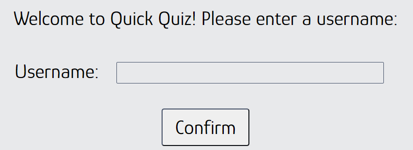

- **Welcome statement**

  - A short statement welcoming the user to the site and prompting them to input a username

  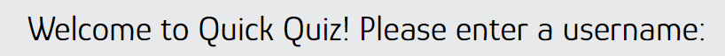

- **Username input**

  - Text input box allowing the user to enter a username which is stored as a variable and used throughout the quiz. Adds a personal element to the quiz.

  

- **Confirm button**

  - When clicked displays a second welcome message containing entered username to the user and runs the main quiz. If user attempts to progess without entering a username they receive an alert stating the must do so to continue.

  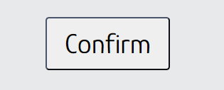

  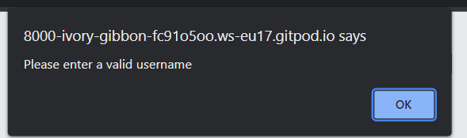

  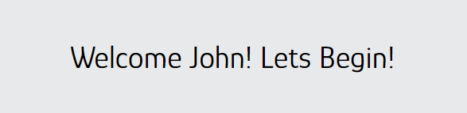

- **Instructions**

  - Brief statement on how quiz works 

  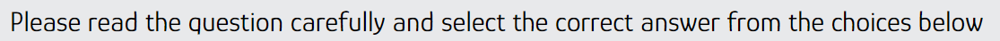

- **Question area**

  - This section is where the randomly generated question is displayed to the user. It is displayed in large text and bordered top and bottom so as to stand out. 

  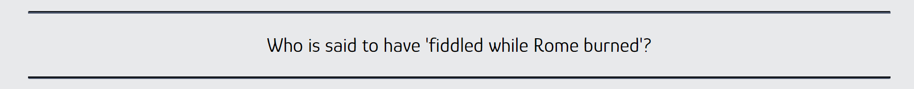

- **Answer area**

  - This section is where the four answers connected to the specific question being asked are displayed to the user. The order in which the answers appear is randomised. The answer choice appears as buttons which when clicked by the user progress the quiz. The users choice is checked against the correct answer and score variable updated accordingly. On desktop the buttons are highlighted when hovered over and on touchscreen devices they have a transfrom effect applied when tapped by the user.

  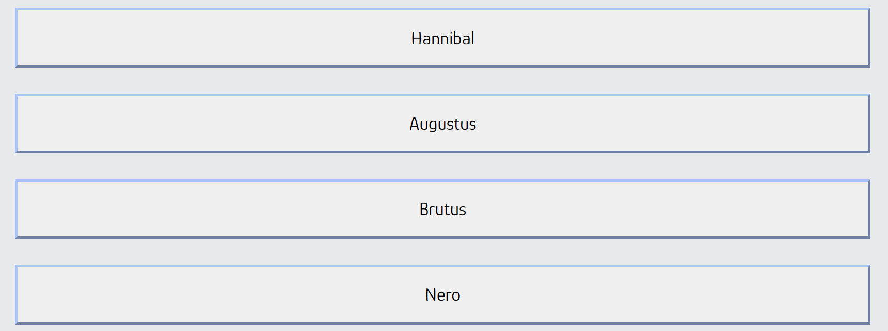

  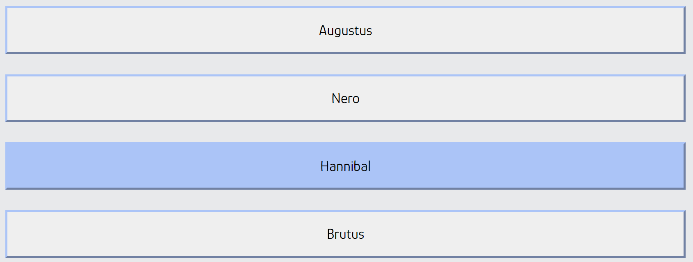

- **End of quiz**

  - Once user has completed all questions the quiz is finished and the user receives feedback. This includes a congratulations message, which utilises the previously entered username for personalisation sake, their score, and a prompt to play again if desired. Clicking the play again button reloads the page and provides the user with a freshly randomised set of questions and answers.

  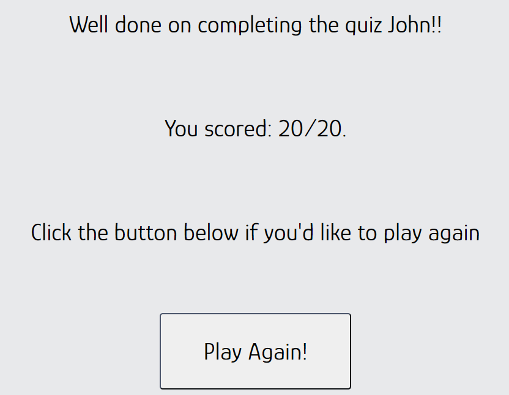

### Features Left to Implement

- One user stated they would like more questions or possibly a different set of questions to choose.

- I had originally intended to implement a difficulty level but chose not to. This is something I would still be interested in implementing as I feel it would only add to the enjoyability of the quiz, as well as allowing for a larger question pool, as mentioned above.

- I could possibly introduce a high score function which would store the users previous attempts and allow them to compete against themselves or others. 

## Testing

The site has been consistently tested throughout its development by both myself and others. Any time a new HTML, CSS, or JS element was introduced it was stringently tested before it was either implemented or discarded.

All html elements serve their intended purpose at time of submission. All styles work as intended and add to the overall user experience. The site has been stress tested on a large number of different browsers and screen sizes both using emulators on dev tools as well as physical mobile devices and tablets. Both the myself and others viewed the site on a number of personal platforms, android and ios, and found the site to work as intended on different screen sizes and browsers.

I had some difficulty with both the checkAnswer and runQuiz functions towards the end of my project. I tried numerous different methods and spent a reasonable amount of time troubleshooting before my mentor looked at my code and offered his advice which thankfully was the push I needed to realise and rectify my mistake, which turned out to be mercifully simple.

One user found two issues, one where he received a score of 21/20 and one where the desktop style was being applied on his android device. He states he is using the most up to date software and hardware versions and he and I are both currently unable to replicate these issues.

When viewed on Microsoft Edge there are several 'issues' displayed when viewing dev tools. I brought this to the attention of my mentor as I was unable to understand the exact meaning behind them and he stated he also wasn't entirely sure on what the meant. He told me to submit as is, since the site functions as intended with no 'errors', and I would end up wasting time otherwise.

Efforts were made beginning, during, and at the end of development to optimise the site as best as possible. This included colour palette generators and contrast checkers for accessibility, the addition of alt attributes where necessary, and search engine optimisation.

A colour palette was generated and the chosen colours ran through a contrast checker to ensure a pleasant experience and large degree of accessibility for the site. 

A lighthouse report was generated in order to check performance, accessibility, etc.

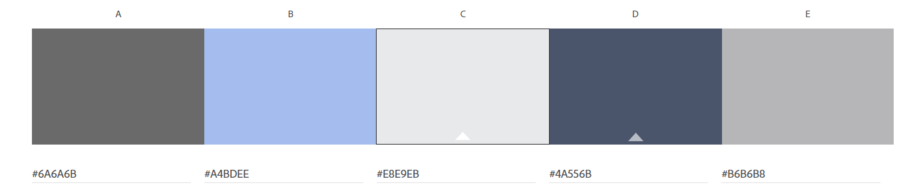

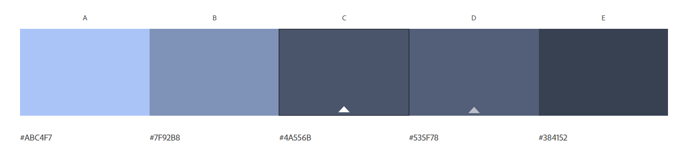

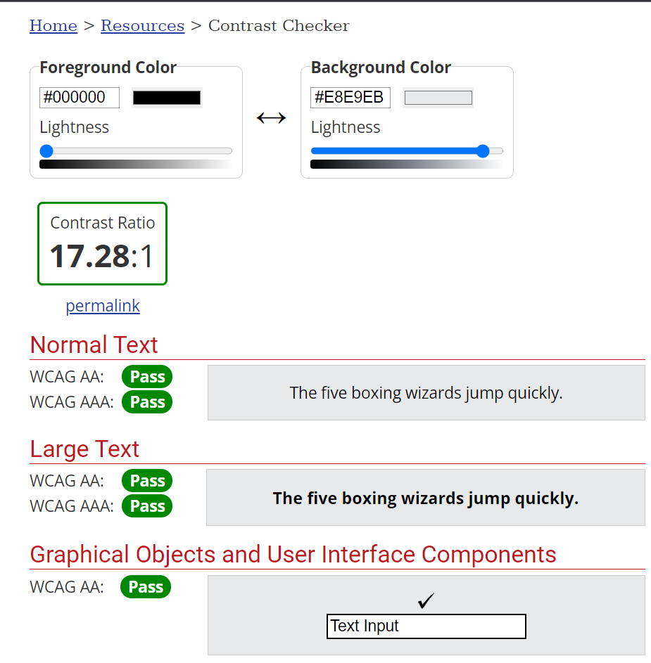

### Validator Testing

- HTML
  - No errors were returned when passing through the official [W3C validator](https://validator.w3.org/)
- CSS
  - No errors were found when passing through the official [(Jigsaw) validator](https://jigsaw.w3.org/css-validator/)
- JS
  - No errors were returned when passing through a JavaScript linter [JSHint](https://jshint.com/)

### Unfixed Bugs

- As mentioned above one user reported two issues which neither he nor myself were then able to replicate. I would be eager to know what caused these. 

## Deployment

- The site was deployed to GitHub pages. The steps to deploy are as follows:
  - In the GitHub repository, navigate to the Settings tab
  - From the source section drop-down menu, select the Main Branch
  - Once the Main Branch has been selected, the page will be automatically refreshed with a detailed ribbon display to indicate the successful deployment.

The live link can be found here - https://johnathonanon.github.io/quick-quiz/

## Credits

A number of questions were found here - https://www.radiotimes.com/quizzes/pub-quiz-general-knowledge/

refreshQuiz function inspiration from here - https://stackoverflow.com/questions/5480945/refreshing-page-on-click-of-a-button/5480965

Some inspiration was taken from Code Institute lessons and the walkthrough project love-maths, specifically the implementation of the event listener on line 181 in script.js.

My mentor was very helpful and his knowledge and experience is highly appreciated. His input was especially helpful when troubleshooting the runQuiz and checkAnswer functions, on lines 116 and 160 in script.js respectively.

